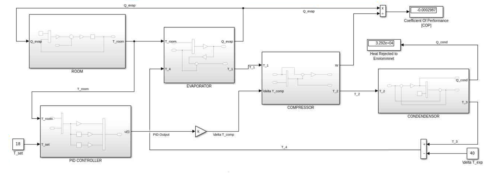

# 🧊 Refrigeration PID Control System (Simulink Model)

This project simulates a **closed-loop refrigeration system** using a **PID controller** to regulate room temperature. It models the complete refrigeration cycle including the **evaporator**, **compressor**, **condenser**, and **room heat dynamics** using MATLAB Simulink.

---

## 🚀 Project Overview

- **Control Method**: PID Controller  
- **Target**: Maintain desired room temperature (`T_set`)  
- **Components Modeled**:
  - Room thermal behavior
  - Evaporator (heat extraction)
  - Compressor (work input)
  - Condenser (heat rejection)
  - Feedback loop for temperature control
- **Performance Metric**: Coefficient of Performance (COP)

---

## 📂 Model Structure

- **PID Controller**  
  Compares room temperature with setpoint and adjusts compressor input (`ΔT_comp`).

- **Evaporator**  
  Calculates heat extracted from the room based on refrigerant temperature difference.

- **Compressor**  
  Increases refrigerant temperature using power input; modeled using `Q = m·Cp·ΔT`.

- **Condenser**  
  Rejects heat to the environment and calculates heat released (`Q_cond`).

- **Room Model**  
  Tracks internal room temperature based on environment temperature, heat gain/loss, and evaporator cooling effect.

- **COP Calculation**  
  Calculates system efficiency as:
  COP = Q_evap/W

---

## 📊 Inputs & Outputs

| Signal      | Description                          |
|-------------|--------------------------------------|
| `T_set`     | Desired room temperature             |
| `T_room`    | Current room temperature             |
| `Q_evap`    | Heat extracted from the room         |
| `Q_cond`    | Heat rejected to the environment     |
| `W`         | Work done by the compressor          |
| `COP`       | Coefficient of Performance           |

---

## 📈 Features

✅ Closed-loop temperature control  
✅ Modular component blocks (room, compressor, condenser, evaporator)  
✅ Realistic thermodynamic modeling  
✅ COP and power monitoring  
✅ Easy PID tuning  
✅ Beginner-built, educational project  

---

## 🛠️ Requirements

- MATLAB R2025a 
- Simulink  

---

## 🧠 How It Works

1. The **PID controller** compares `T_set` and `T_room`, generating a control signal.
2. This signal adjusts the **compressor**, modifying the refrigerant's temperature.
3. The refrigerant circulates through the **evaporator**, cooling the room.
4. The **room block** calculates the new room temperature.
5. The cycle repeats, and **COP** is updated dynamically.

---

## 📸 Screenshots

### System-Level Overview
 

---

## 🧑‍💻 Author

**[Akshat Gupta]**  
Beginner control systems enthusiast working on real-world thermal models using Simulink.

---

## 🙌 Acknowledgements

Inspired by refrigeration cycle dynamics and HVAC control logic.  
Big shoutout to the MATLAB & Simulink community!

